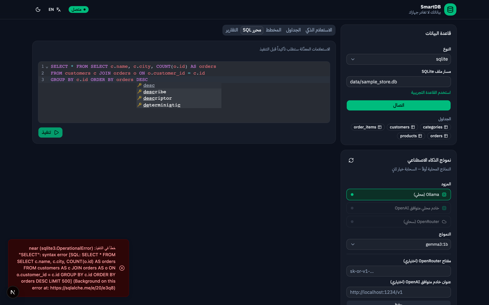
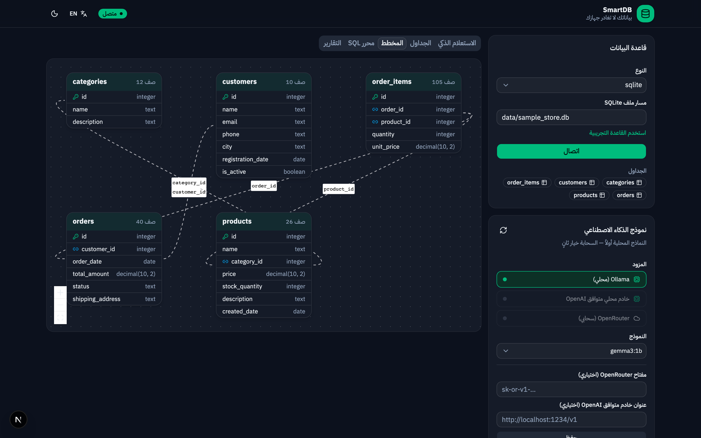
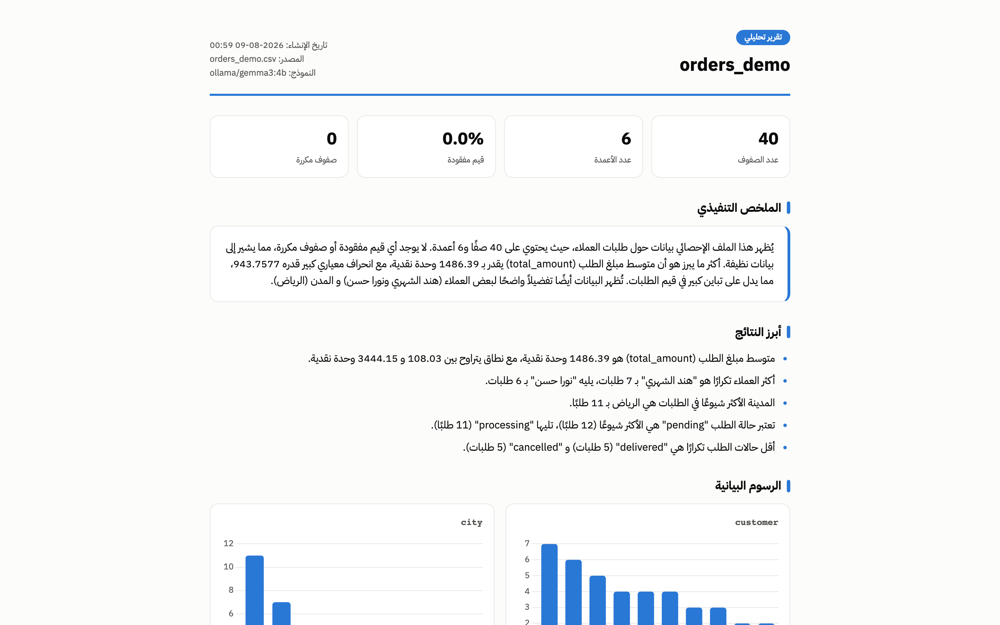
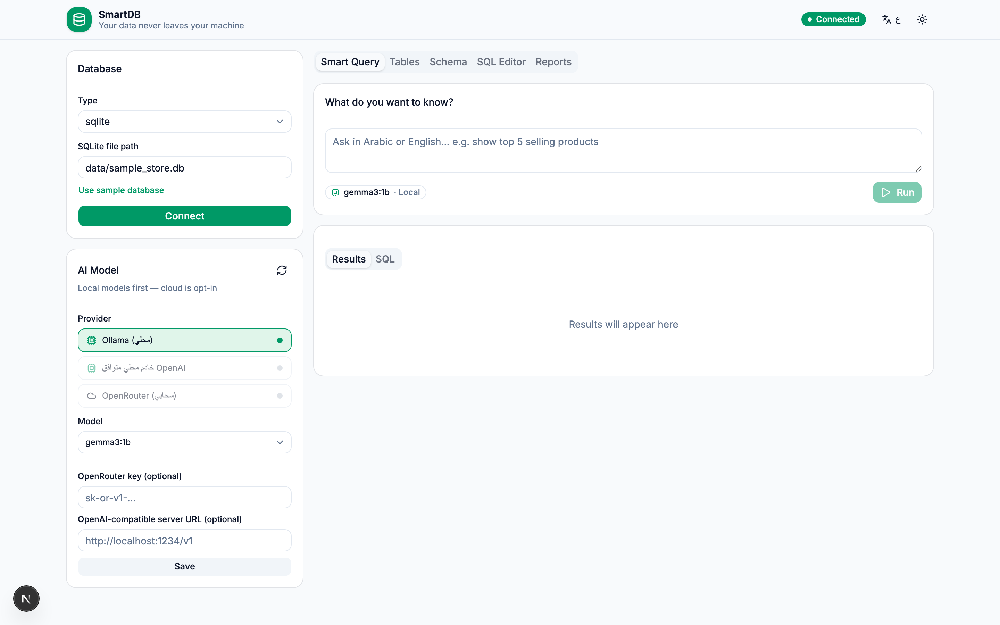
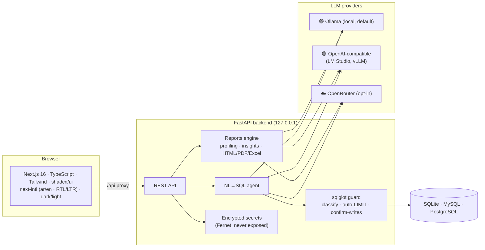

<div align="center">

# SmartDB — AI Database Manager

**بياناتك لا تغادر جهازك · Your data never leaves your machine**

[](../../actions)
[](https://python.org)
[](https://fastapi.tiangolo.com)
[](https://nextjs.org)
[](LICENSE)

*A bilingual (Arabic/English), local-first AI platform for managing databases and generating professional analytics reports — powered by the LLMs already running on your machine.*

*منصة ثنائية اللغة لإدارة قواعد البيانات وتوليد تقارير تحليلية احترافية بالذكاء الاصطناعي — **بالنماذج المحلية أولاً**، لأن بيانات الشركات يجب أن تبقى داخلها.*

</div>

---

## ✨ Why SmartDB? · لماذا SmartDB؟

Most AI database tools send your schema — and often your data — to the cloud.
**SmartDB is built local-first:** it auto-detects [Ollama](https://ollama.com), lists your
installed models, and every AI feature runs on your machine. Cloud (OpenRouter) is an
explicit, clearly-labeled opt-in.

أغلب أدوات الذكاء الاصطناعي ترسل مخطط قاعدتك — وأحياناً بياناتك — إلى السحابة.
SmartDB مبني على مبدأ **المحلية أولاً**: يكتشف Ollama تلقائياً ويعرض نماذجك المثبتة،
وكل ميزات الذكاء تعمل على جهازك. السحابة خيار ثانٍ صريح ومُعلَّم بوضوح.

## 🎬 Features · الميزات

### 🗣️ Natural language → SQL · الاستعلام باللغة الطبيعية
Ask in Arabic or English; a local model writes the SQL and runs it safely.



### 🛡️ Safe by design · آمن بالتصميم
Every statement is parsed with **sqlglot** — anything that modifies data shows a
**confirmation dialog with the exact SQL before execution**. Unbounded SELECTs get an
automatic LIMIT. Identifiers are validated against the live schema; API keys are
encrypted at rest and **never returned to the browser**; the server binds to
`127.0.0.1` only.

### 🗄️ Full management suite · إدارة شاملة
Interactive ER diagram, editable data grid (double-click any cell), SQL editor with
highlighting, CSV/Excel import, exports, and one-click SQLite backup.



### 📊 Reports Studio · استوديو التقارير
Upload any CSV/Excel/JSON → automatic profiling (stats, outliers, correlations) →
**a local model writes the executive summary, findings, and recommendations** in your
language → export as a self-contained interactive HTML page, a print-ready PDF, or a
styled Excel workbook — with a browsable archive.



### 🌍 Bilingual & themed · لغتان وثيمان
Full Arabic (RTL) and English (LTR) with one-click switching; dark and light themes.



## 🚀 Quickstart

### Option A — Docker (one command)

```bash
docker compose up --build
```

Then open <http://localhost:3000>. (Ollama on the host is reached automatically.)

### Option B — Local dev

Requirements: Python 3.10+, Node 20+ with pnpm, [Ollama](https://ollama.com)
(`ollama pull gemma3:4b` recommended).

```bash
# Backend
cd backend && python3 -m venv .venv && .venv/bin/pip install -e ".[dev]"
# PDF export (optional): .venv/bin/pip install playwright && .venv/bin/playwright install chromium

# Frontend
cd ../frontend && pnpm install

# Run both from repo root
./scripts/dev.sh
```

Open <http://localhost:3000>, connect to `data/sample_store.db`, pick a model, and ask:
**"أظهر أفضل 5 منتجات مبيعاً"** — or upload a spreadsheet in the Reports tab.

## 🏗️ Architecture



## 🧪 Quality

- **75 automated backend tests** (pytest) covering the SQL guard (incl. CTE edge cases),
  CRUD identifier safety, secrets non-exposure, report generation, and the full API.
- CI runs tests + a production frontend build on every push.
- Every phase was verified end-to-end in a real browser against a real local model.

```bash
cd backend && .venv/bin/pytest
```

## 🔒 Security model · نموذج الأمان

| Threat | Mitigation |
|---|---|
| Destructive AI-generated SQL | Parsed & classified before execution; writes/DDL require explicit user confirmation |
| SQL injection via identifiers | Table/column names validated against live schema, values bound as parameters |
| API key leakage | Keys encrypted at rest (Fernet); API returns only `has_key: true/false` |
| Network exposure | Binds to `127.0.0.1` by default; Docker ports published to localhost only |
| Runaway queries | Automatic LIMIT on unbounded SELECTs; upload size caps |

## 🗺️ Roadmap

- [x] Phase 1 — Local-first LLM layer, safe NL→SQL, bilingual UI
- [x] Phase 2 — Management suite: ER diagram, CRUD grid, SQL editor, import/export/backup
- [x] Phase 3 — Reports Studio: profiling, AI insights, HTML/PDF/Excel exports, archive
- [x] Phase 4 — Docker, CI, docs
- [ ] Hosted demo · query history · scheduled reports · NoSQL

## 📄 License

[MIT](LICENSE) — built with ❤️ (and a local GPU) in Saudi Arabia.
